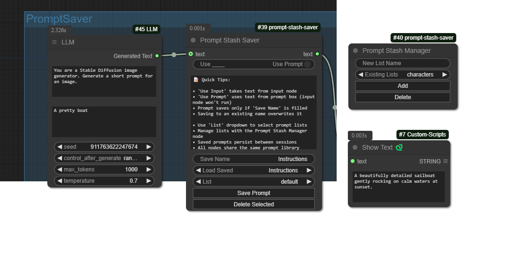

# Prompt Stash Node for ComfyUI

## Overview 📚

**Prompt Stash** is a simple plugin for ComfyUI that lets you save your prompts and organize them into multiple lists. It also features pass-through functionality, so you can hook it up to an LLM node (or any text outputting node) and capture its outputs directly—no more tedious copy-pasting! 🙌

I created this because I couldn't find any nodes that would let me cache a prompt or create and save prompts. I wanted an easy way to cache results from the LLM and store them for later use. So, I made this plugin, and I hope others find it useful too. 😊

## Features ✨

- **Save Prompts**: Easily save prompts with a custom name for quick access.
- **Multiple Lists**: Organize your prompts into different lists or categories.
- **Pass-Through Functionality**: Connect to LLM nodes and capture their outputs directly into the plugin.
- **Pause & Edit**: Pause workflow execution to edit prompts in real-time.
- **Persistent Storage**: Your prompts and lists are saved between sessions.
- **Shared Library**: All nodes share the same prompt library across your workflow.

## How to Use 🛠️

### Prompt Stash Saver Node

This node lets you save, load, and manage your prompts.

1. **Add the Node**: Place the **Prompt Stash Saver** node into your graph.

2. **Input Text**:
   - **Option 1**: Type directly into the **Prompt Text** field.
   - **Option 2**: Connect another node (like an LLM node) to the input. Toggle **Use Input** to use the connected input.

3. **Select a List**: Use the **List** dropdown to choose which list you're working with.

4. **Save a Prompt**:
   - Enter a name in the **Save Name** field.
   - Click **Save Prompt**. 💾
   - If you use an existing name, it'll overwrite the old prompt.

5. **Load a Prompt**: Choose a prompt from the **Load Saved** dropdown to load it.

6. **Delete a Prompt**: Select a prompt and click **Delete Selected** to remove it. 🗑️

### Prompt Stash Passthrough Node

This lightweight node allows you to modify text as it passes through your workflow.

1. **Add the Node**: Place the **Prompt Stash Passthrough** node into your graph.

2. **Input Text**:
   - **Option 1**: Type directly into the **Prompt Text** field.
   - **Option 2**: Connect another node to the input. Toggle **Use Input** to use the connected input.

3. **Pause to Edit** (Optional):
   - Enable the **Pause to Edit** toggle if you want to pause workflow execution.
   - When paused, you can edit the text in real-time.
   - Click **Continue** when you're done editing to resume the workflow.

### Prompt Stash Manager Node

This node helps you manage your prompt lists and workflow state.

1. **Add the Node**: Place the **Prompt Stash Manager** node into your graph.

2. **Add a New List**:
   - Enter a name in the **New List Name** field.
   - Click **Add** to create the list. ➕

3. **Delete a List**:
   - Select a list from the **Existing Lists** dropdown.
   - Click **Delete** to remove it. 🗑️
   - **Note**: You cannot delete the last remaining list.

4. **Clear Paused State**:
   - If any workflows were closed while paused or the pause button vanishes, click **Clear All Paused** to reset all pause states.
   - This helps prevent workflows from getting stuck in a paused state.

## Installation 📥

1. **Download the Plugin**: Clone or download this repository.

2. **Install in ComfyUI**: Place the plugin folder into your `custom_nodes` directory inside ComfyUI.

3. **Restart ComfyUI**: Restart the application to load the new nodes.

## License 📝

This project is licensed under the Apache License 2.0.

---

Thanks for checking out **Prompt Stash**! If you have any feedback or suggestions, feel free to reach out or contribute. Happy prompting! 🚀

---